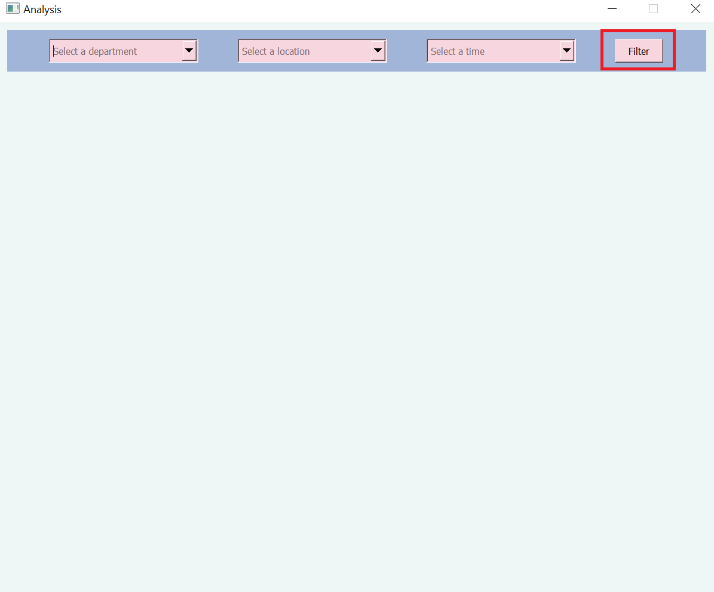
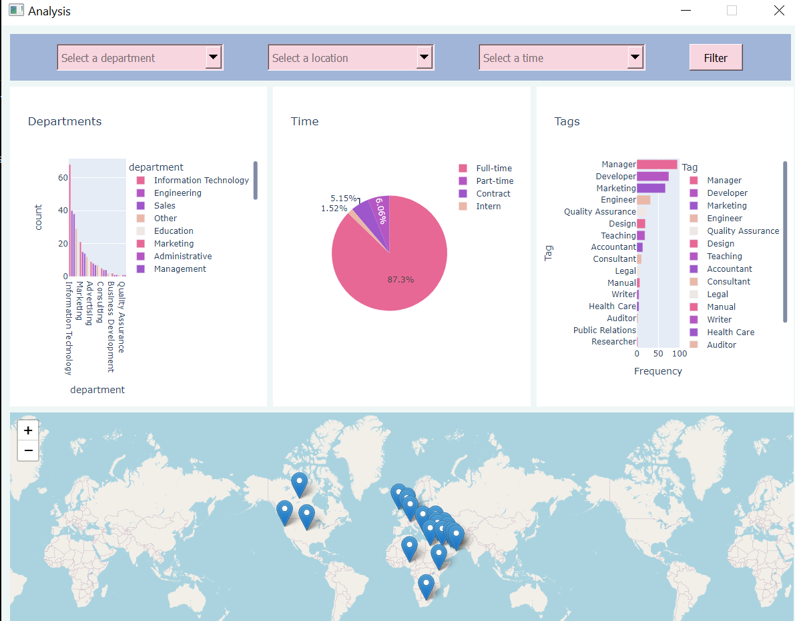
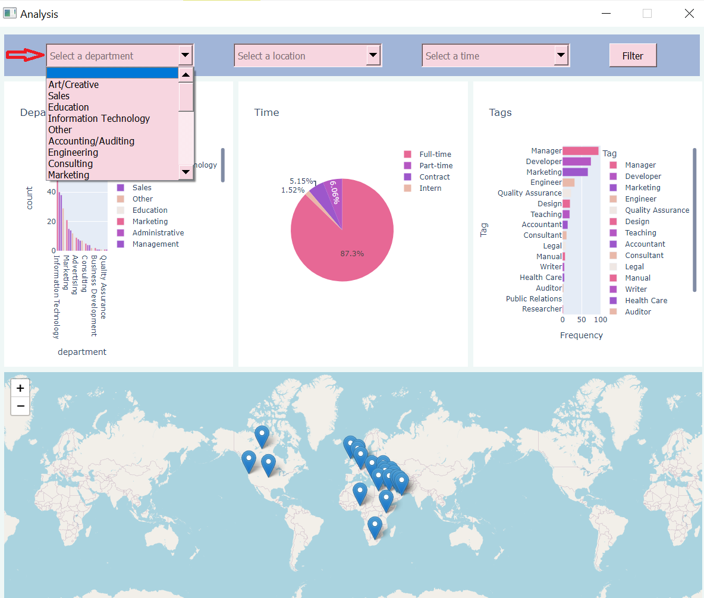
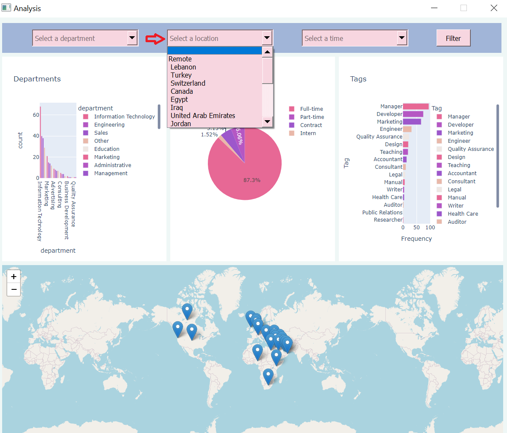
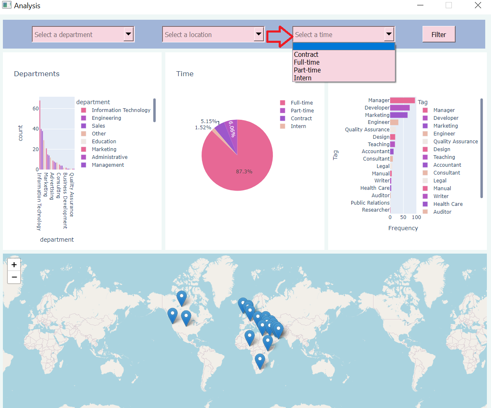
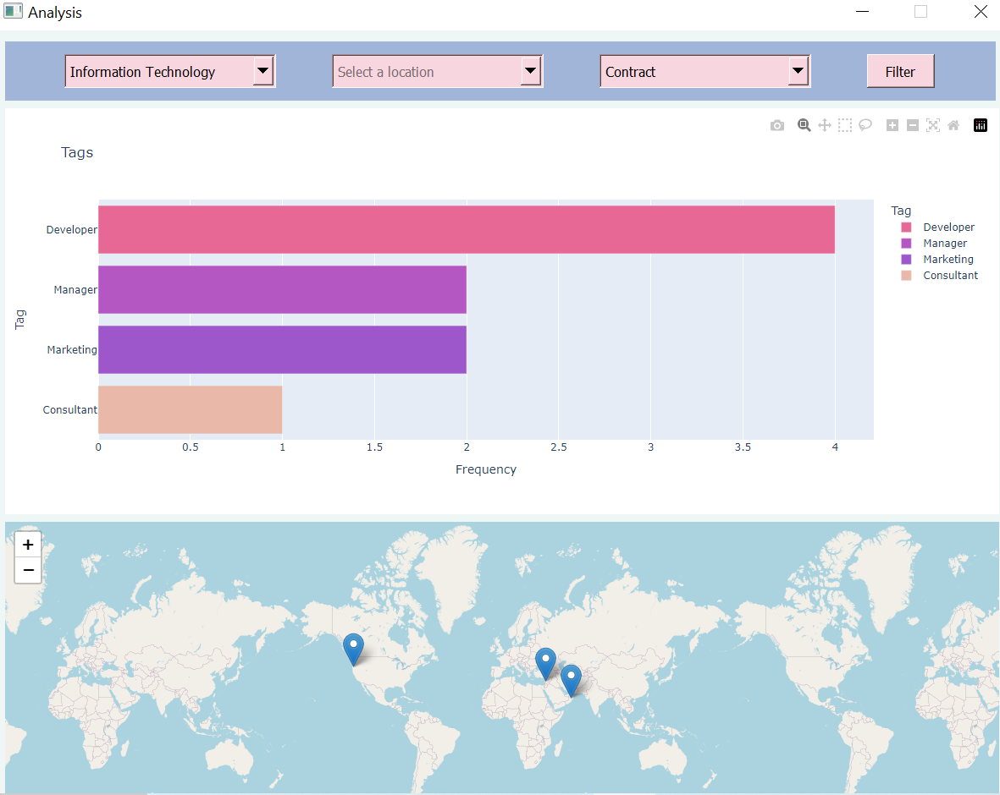

# Job Analytics Lebanon


## Introduction:

In the dynamic landscape of the Lebanese job market, it has become increasingly evident that there is a noticeable dearth of comprehensive studies and research dedicated to exploring the perspectives and opportunities available to job seekers. This gap in understanding has left job seekers navigating the employment landscape without the necessary insights and tools to make informed decisions about their career paths. To address this pressing issue, our ambitious project is driven by the purpose of filling this void and providing a powerful and efficient means to analyze and visualize job prospects within Lebanon.

Our project stands as a beacon of hope for job seekers who are often left to their own devices in a complex and rapidly changing job market. By leveraging cutting-edge technology and innovative methodologies, we intend to offer a robust solution that will empower job seekers with valuable insights into their employment options. Here is how our project aims to achieve this:

1. **Comprehensive Data Collection:** To build a solid foundation, we will meticulously collect data from various sources, including job postings, industry reports, and government statistics. This data will encompass a wide range of factors, including job titles, industries, locations, educational requirements, and employment types.

2. **Sophisticated Analysis:** With a wealth of data at our disposal, our project will employ advanced data analysis techniques within the Lebanese job market. We will explore how different industries are evolving and which job sectors are growing.

3. **Visualization Tools:** To make the information easily accessible and understandable for job seekers, we will develop intuitive and user-friendly data visualization tools. These tools will enable users to interact with the data, allowing them to explore job opportunities  and employment patterns across departments, locations, and employment types.

4. **Real-time Updates:** The job market is dynamic and constantly evolving. Therefore, our project will incorporate real-time data updates to ensure that job seekers have access to the most current information, enabling them to adapt to changing market conditions effectively.

By embarking on this ambitious endeavor, our project seeks to empower job seekers in Lebanon with the knowledge and tools they need to navigate the job market with confidence. Through data-driven insights and user-friendly interfaces, we aim to bridge the gap between job seekers and employment prospects, fostering a more informed and thriving workforce within Lebanon. Ultimately, we believe that this initiative will contribute to the overall growth and prosperity of the Lebanese economy by aligning talent with opportunity in a more efficient and effective manner.
In the Lebanese Job Market, there is a lack of studies concerning the prospectives of job seekers.
Therefore this project aims to provide an efficient way to analyze and visualise job opportunities and patterns between departments,locations,employment type.


## How to run the program?
This program uses selenium,pyqt5,PyQtWebEngine,folium,OpenCageGeocode,plotlyexpress. To install the required dependencies, run:

```
$ pip install -r requirements.txt
```

Then you can run the code using:
for running Window use:
```
python GUI.py
```
for recollecting data:
```
python webscraping.py
```


## user Manual:


## 1


click the filter button, display statistical plots about the filtered data.


## 2


The first bar graph shows the number of jobs in each department.
The pie chart next illustrates the employment type distribution.
The adjacent bar graph displays the number of jobs associated with specific tags or categories.
The map provides information about the distribution of job locations.


## 3


Filter the job opportunities for each of the following departments.


## 4


Filter the job opportunities for each of the following locations.


## 5


Filter the job opportunities for each of the following employee type.


## 6



A sample where the output was filtered on department Information Technology and Contract Employee type with no location filter.


## program structure
 

 In this program a capture file from Wireshark, is taken and turned into a form usable by a reguler user


## building.py:

contains a class `Packet` which the program revolves around

the program uses this class ass a storage and organization system, where every packet captured by pyshark is tunred into an instance of this class.


that is done in the `infile` function that takes the directory of a capture file, and returns a list of objects of type `Packet`.


 `infile` itself contains the following functions:


 `creat` a method that will be applied on the pyshark captured list, which will in turn fill the list of packets that will be returned 

 `url` gets the host name of every destantion IP address by reverse quary 

 `location` gets the Geolocation of every public destenation IP adress present in the capture

 `fillinglocs` inserts into the list the locations where the destentation IP is equal to the one geolocated


## main:


contains the GUI or the program, has a class `MainWindow` which inherets QMainWindow and Ui_MainWindow


this class has a `__init__` function that ties the buttons to thier clicked functions 


`create_map_first` function that creates the map the program will use to stor the data collected 


`clicker` a funtion that is responsible for oppening the map HTML file in the browser


`st_browse_path`  gets the path of the capture file the user chooses

`importer` the button risponsible for the running of the proccess of analizing the capture

`maping` puts the geolocation data in a way the map can proccess 

`plotting` plots the locations on the maps with their corrisponding source IP and destination IP

`combo` fills the drop down menue with distincet source IP addresses 

`test` prints the returend list as a string in the comand line, for trouble shooting purpuses 


`screanShow` sets the text of the "display" the a list in a form of a string

`web_numb` counts the number of packets with a DNS hostname

`ip_numb` counts the number of distinct source IP addresses 

`paKnumb` counts the number of packets in the capture

`stringing` turns a packet into a sting of its infomation

`printer` turns a list of packets into a stiring using `stringing` on each packet

`selectCombo` fileter whats on the display according to the source ip chosen by the user 

`themes`  sets the style of the GUI


## NOTE:


 this program was developed under at the internet speeds of a low income neighborhood in a third world country(Lebanon) some issues might arise wit IP geolocation, since the website limits the number of requests per second,  you might need to tweak the "time.sleep" in line 102 in building.py


